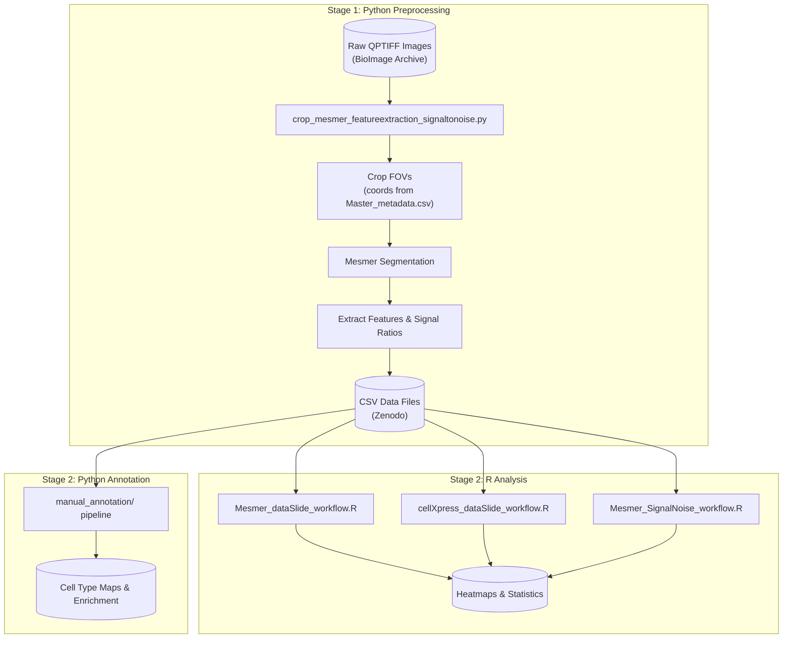

### Benchmarking Tissue Preparation

Large-scale Quantitative Assessment of Tissue Preparation and Staining Conditions for Robust Multiplexed Imaging.

#### Table of Contents

- [Project Overview](#project-overview)
- [Workflow Overview](#workflow-overview)
- [Data Sources](#data-sources)
- [Quick Start](#quick-start)
- [Detailed Workflows](#detailed-workflows)
- [Configuration Reference](#configuration-reference)
- [Output Files](#output-files)
- [Directory Structure](#directory-structure)
- [Contributors](#contributors)

## Project Overview

This repository provides analysis workflows to benchmark tissue preparation and staining conditions across multiple multiplexed imaging platforms. It generates publication-ready figures, heatmaps, and statistics comparing different antigen retrieval conditions.

**Key capabilities:**

- Compare marker signal intensities across conditions (Mesmer/CellXpress workflows)
- Calculate signal intensity ratios inside vs outside cell masks
- Perform manual cell type annotation (Python pipeline)
- Quantify spatial heterogeneity (Balagan analysis)

## Workflow Overview

The analysis has two main stages:

### Stage 1: Image Preprocessing (Python)

**Script:** [`crop_mesmer_featureextraction_signaltonoise.py`](crop_mesmer_featureextraction_signaltonoise.py)

**Inputs:**

- Raw QPTIFF images from [BioImage Archive](https://www.ebi.ac.uk/bioimage-archive/) (accession TBD)
- FOV crop coordinates from [`Master_metadata.csv`](Master_metadata.csv) or Supplementary Table 18

**Process:**

1. Crop images to FOV regions
2. Run Mesmer cell segmentation
3. Extract single-cell marker intensities
4. Calculate signal intensity ratios inside vs outside cell masks

**Outputs (per slide/FOV):**

- Mesmer mask and overlays: `MESMER_mask.tiff`, `seg_overlay.tiff`, `seg_outline.tiff`
- Single-cell feature CSVs: `data_slide{key}_{FOV}.csv`, `dataScaleSize_slide{key}_{FOV}.csv`
- Per-marker cropped TIFFs: `Individualtiff_slide{key}_{FOV}/{marker}.tiff`
- Signal intensity ratios per marker: `signal_ratios_slide{key}_{FOV}.csv` (column: `Normalized_signal_invsout`)

Pre-generated CSVs are available on Zenodo for convenience.

### Stage 2: Statistical Analysis and Visualization (R)

**Scripts:** `Mesmer_dataSlide_workflow.R`, `cellXpress_dataSlide_workflow.R`

**Inputs:** CSV files from Stage 1 (or downloaded from Zenodo)

**Outputs:** Heatmaps, density plots, statistical comparisons



> **Note:** Most users can skip Stage 1 by downloading the pre-generated CSVs. Stage 1 is only needed if you start from raw images.

## Data Sources

### Where to Get Data

| Data Type       | Location                                                          | Description                             |
| --------------- | ----------------------------------------------------------------- | --------------------------------------- |
| Raw Images      | [BioImage Archive](https://www.ebi.ac.uk/bioimage-archive/) (TBD) | Original QPTIFF files                   |
| Processed CSVs  | [Zenodo](https://zenodo.org/) (TBD)                               | Single-cell marker intensities          |
| FOV Coordinates | [`Master_metadata.csv`](Master_metadata.csv)                      | Crop coordinates, conditions, platforms |

### Master Metadata

[`Master_metadata.csv`](Master_metadata.csv) contains comprehensive file mappings for all datasets:

- **Dataset**: Initial_Optimization, Validation, or Supplementary
- **Site**: BIDMC, Stanford, Roche, Novartis, ASTAR, UKentucky
- **Tissue**: Tonsil, DLBCL, Lung_Cancer, CRC, etc.
- **Condition**: Antigen retrieval parameters
- **Platform**: PhenoCycler-Fusion, RareCyte_Orion, IMC, Lunaphore_COMET
- **Pixel_Size**: Micrometers per pixel
- **FOV Coordinates**: (x_min, x_max, y_min, y_max) for cropping
- **Annotation files**: Paths to segmentation masks, GeoJSONs, h5ad files (BIDMC only)

### Metadata Files in data_mesmer/ and data_cellXpress/

| File                                    | Purpose                                              |
| --------------------------------------- | ---------------------------------------------------- |
| `Slide_metadata.csv`                    | Maps CSV filenames to source, type, FOV, sample name |
| `Slide_compare_pairs.csv`               | Defines pairs for statistical comparisons            |
| `Slide_exclude_markers.csv`             | Markers to gray out (non-working)                    |
| `Slide_remove_markers.csv`              | Markers to exclude entirely                          |
| `Registered_Report_marker_sequence.csv` | Marker display order for heatmaps                    |

See [data_mesmer/README.md](data_mesmer/README.md) for detailed data organization.

## Quick Start

### 1. Setup Environment

```bash
# Python (for preprocessing and manual annotation)
pip install -r requirements.txt
pip install deepcell  # For Mesmer segmentation

# R packages
Rscript -e 'install.packages(c("dplyr", "tidyverse", "matrixStats", "ggcorrplot", "ggpubr", "tidyr", "rstatix", "readr", "svglite", "devtools", "qs"))'
Rscript -e 'devtools::install_github("immunogenomics/presto")'
```

### 2. Get Data

Download processed CSV files from Zenodo and place in:

- `./data_mesmer/` for Mesmer workflow
- `./data_cellXpress/` for CellXpress workflow

### 3. Run Analysis

```r
# In R/RStudio, open and edit the workflow script:
current_config_name <- "BIDMC_all"  # Choose your configuration
source("Mesmer_dataSlide_workflow.R")
```

Outputs appear in `./results/out_<CONFIG>/`

## Detailed Workflows

### Main Analysis (Mesmer / CellXpress)

Compares marker signal intensities across tissue preparation conditions.

**Scripts:**

- `Mesmer_dataSlide_workflow.R` - Mesmer segmentation data
- `cellXpress_dataSlide_workflow.R` - CellXpress segmentation data

**Usage:**

1. Open script in R/RStudio
2. Set `current_config_name` to your target dataset
3. Run the script

**Key outputs:** Density plots, heatmaps (mean, CV, z-scores), statistical tests (Kruskal-Wallis, Wilcoxon, Cohen's d)

---

### Signal Intensity Ratio Analysis

Analyzes signal intensity ratios inside vs outside cell masks.

**Step 1: Preprocess images (Python)**

```bash
python crop_mesmer_featureextraction_signaltonoise.py
```

Configure in script:

- `data_folder`: Path to QPTIFF files
- `output_folder`: Output directory
- `crop_coords_dict`: FOV coordinates (from `Master_metadata.csv`)
- `markers`: Marker names in channel order

**Step 2: Run R visualization**

```bash
Rscript process_cell_counts.R
Rscript Mesmer_SignalNoise_workflow.R
```

**Key outputs:** Signal intensity ratio heatmaps, mean ratio barplots

---

### Manual Annotation

Python pipeline for cell type annotation of the 24 BIDMC-Harvard slides.

**Location:** [`./manual_annotation/`](https://github.com/SizunJiangLab/Benchmarking_tissue_preparation/tree/main/manual_annotation)

**Pipeline:**

1. `01_clustering.py` - PhenoGraph clustering (k=200)
2. `02_annotation.py` - Cell type annotation
3. `03_phenotype_map.py` - Phenotype map visualization
4. `04_stacked_bar_plots.py` - Cell type composition
5. `05_enrichment_plots.py` - Enrichment analysis

**Inputs:** OME-TIFFs, segmentation masks, h5ad files, GeoJSONs (file paths in `Master_metadata.csv`)

See [manual_annotation/DOCUMENTATION.md](manual_annotation/DOCUMENTATION.md) for complete instructions.

---

### Balagan Spatial Analysis

Quantifies spatial heterogeneity and subsampling efficiency.

**Location:** `./balagan_analysis/`

**Key metrics:**

- Tau (τ): Sampling efficiency
- Alpha (α): Spatial heterogeneity

**Install:** `devtools::install_github("PierreBSC/Balagan")`

See [balagan_analysis/README.md](balagan_analysis/README.md) for workflow.

## Configuration Reference

### Available Configurations

Set `current_config_name` in the workflow scripts to one of:

**Initial Optimization:**

- `BIDMC_all`, `Roche_all`, `Stanford_all`

**Validation:**

- `ASTAR_COMET_CRC_all`, `ASTAR_COMET_Tonsil_all`
- `BIDMC_DLBCL_all`, `BIDMC_Tonsil_all`
- `Novartis_Lung_Cancer_all`, `Novartis_Tonsil_all`
- `Roche_Tonsil_all`, `Roche_intestine_all`
- `Stanford_IMC_OSCC_all`, `Stanford_IMC_Tonsil_all`
- `Stanford_MIBI_Colon_all`, `Stanford_MIBI_Liver_all`, `Stanford_MIBI_LymphNode_pooled_all`
- `Stanford_Orion_EndometrialCancer_all`, `Stanford_Orion_LN_all`
- `UKentucky_SCC_all`, `UKentucky_Tonsil_all`

**CellXpress:** Same names with `_cellXpress` suffix instead of `_all`

## Output Files

All outputs are written to `./results/out_<CONFIG>/`

| Category       | Files                                                              |
| -------------- | ------------------------------------------------------------------ |
| Visualizations | `Heatmap_mean_*.svg`, `Heatmap_CV_*.svg`, density plots            |
| Statistics     | `kruskal_pvals.csv`, `wilcox_results.csv`, `cohens_d_results.csv`  |
| Processed data | `mean_values.csv`, `cv_values.csv`, `*_z_scores.csv`               |
| Scoring        | `condition_summary.csv`, `marker_summary.csv`, `total_z_ranks.csv` |
| Provenance     | `config_summary.csv`, `processed_files.csv`, `session_info.txt`    |

## Directory Structure

```
.
├── data_mesmer/                    # Mesmer data (see data_mesmer/README.md)
├── data_cellXpress/                # CellXpress data
├── balagan_analysis/               # Spatial analysis workflow
├── manual_annotation/              # Cell type annotation pipeline
├── pylibs/                         # Python utilities
├── results/                        # Analysis outputs
│   └── out_<CONFIG>/
├── qsave_input/                    # Cached inputs (auto-generated)
├── Master_metadata.csv             # FOV coordinates & file mappings
├── Mesmer_dataSlide_workflow.R     # Main Mesmer workflow
├── Mesmer_SignalNoise_workflow.R   # Signal intensity ratio analysis
├── cellXpress_dataSlide_workflow.R # Main CellXpress workflow
├── crop_mesmer_featureextraction_signaltonoise.py  # Preprocessing
├── helper.R                        # Shared R functions
└── requirements.txt                # Python dependencies
```

## Contributors

- Johanna Schaffenrath
- Cankun Wang
- Shaohong Feng
- Lollija Gladiseva

For questions or feedback, contact Sizun Jiang: sjiang3@bidmc.harvard.edu
