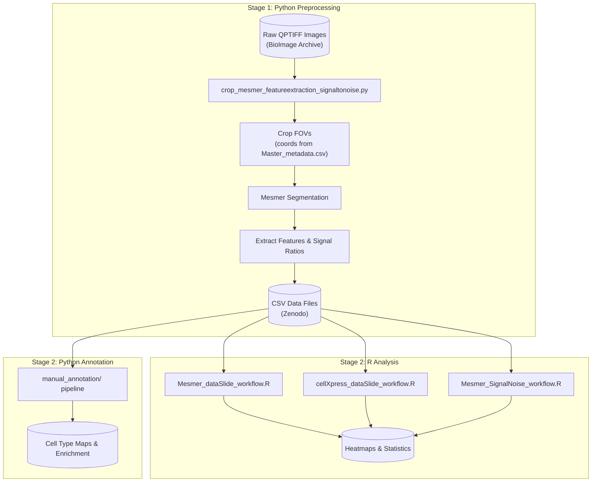

### Benchmarking Tissue Preparation

Large-scale Quantitative Assessment of Tissue Preparation and Staining Conditions for Robust Multiplexed Imaging.

#### Table of Contents

- [Project Overview](#project-overview)
- [Data & Resources](#data--resources)
- [Workflow Overview](#workflow-overview)
- [Quick Start](#quick-start)
- [Configuration Reference](#configuration-reference)
- [Output Files](#output-files)
- [Directory Structure](#directory-structure)
- [Contributors](#contributors)

## Project Overview

This repository provides analysis workflows to benchmark tissue preparation and staining conditions across multiple multiplexed imaging platforms. It generates publication-ready figures, heatmaps, and statistics comparing different antigen retrieval conditions.

**Key capabilities:**

- Compare marker signal intensities across conditions (Mesmer/CellXpress workflows)
- Calculate signal intensity ratios inside vs outside cell masks
- Perform manual cell type annotation (Python pipeline)
- Quantify spatial heterogeneity (Balagan analysis)

## Data & Resources

### Master Metadata

**[`Master_metadata.csv`](Master_metadata.csv)** is the central reference linking all data files across repositories. Each row represents one slide and includes: dataset, site, tissue type, experimental condition, platform, pixel size, FOV crop coordinates, and paths to all associated files (segmentation masks, OME-TIFFs, GeoJSONs, h5ad files).

### Data Locations

| Data Type                | Location                                                          | Description                                    |
| ------------------------ | ----------------------------------------------------------------- | ---------------------------------------------- |
| Raw Images & Annotations | [BioImage Archive](https://www.ebi.ac.uk/bioimage-archive/) (TBD) | QPTIFF files, segmentation masks, OME-TIFFs, GeoJSONs |
| Processed CSVs           | [Zenodo](https://zenodo.org/) (TBD)                               | Single-cell marker intensities                 |
| Code & Metadata          | This GitHub repo                                                  | Analysis scripts, `Master_metadata.csv`        |

### Metadata Files

Located in `data_mesmer/` and `data_cellXpress/`:

| File                                    | Purpose                                              |
| --------------------------------------- | ---------------------------------------------------- |
| `Slide_metadata.csv`                    | Maps CSV filenames to source, type, FOV, sample name |
| `Slide_compare_pairs.csv`               | Defines pairs for statistical comparisons            |
| `Slide_exclude_markers.csv`             | Markers to gray out (non-working)                    |
| `Slide_remove_markers.csv`              | Markers to exclude entirely                          |
| `Registered_Report_marker_sequence.csv` | Marker display order for heatmaps                    |

### Documentation

| Workflow             | Documentation                                              |
| -------------------- | ---------------------------------------------------------- |
| Data organization    | [data_mesmer/README.md](data_mesmer/README.md)             |
| Manual annotation    | [manual_annotation/DOCUMENTATION.md](manual_annotation/DOCUMENTATION.md) |
| Balagan spatial analysis | [balagan_analysis/README.md](balagan_analysis/README.md) |

## Workflow Overview



> **Note:** Most users can skip Stage 1 by downloading the pre-generated CSVs from Zenodo. Stage 1 is only needed if you want to process raw images from BioImage Archive.

## Quick Start

### 1. Setup Environment

```bash
# Python (for preprocessing and manual annotation)
pip install -r requirements.txt
pip install deepcell  # For Mesmer segmentation

# R packages
Rscript -e 'install.packages(c("dplyr", "tidyverse", "matrixStats", "ggcorrplot", "ggpubr", "tidyr", "rstatix", "readr", "svglite", "devtools", "qs"))'
Rscript -e 'devtools::install_github("immunogenomics/presto")'
```

### 2. Get Data

Download processed CSV files from Zenodo and place in:

- `./data_mesmer/` for Mesmer workflow
- `./data_cellXpress/` for CellXpress workflow

### 3. Run Analysis

```r
# In R/RStudio, set your configuration and run:
current_config_name <- "BIDMC_all"  # See Configuration Reference below
source("Mesmer_dataSlide_workflow.R")
```

Outputs appear in `./results/out_<CONFIG>/`

## Configuration Reference

Set `current_config_name` in the workflow scripts to one of:

**Initial Optimization:**

- `BIDMC_all`, `Roche_all`, `Stanford_all`

**Validation:**

- `ASTAR_COMET_CRC_all`, `ASTAR_COMET_Tonsil_all`
- `BIDMC_DLBCL_all`, `BIDMC_Tonsil_all`
- `Novartis_Lung_Cancer_all`, `Novartis_Tonsil_all`
- `Roche_Tonsil_all`, `Roche_intestine_all`
- `Stanford_IMC_OSCC_all`, `Stanford_IMC_Tonsil_all`
- `Stanford_MIBI_Colon_all`, `Stanford_MIBI_Liver_all`, `Stanford_MIBI_LymphNode_pooled_all`
- `Stanford_Orion_EndometrialCancer_all`, `Stanford_Orion_LN_all`
- `UKentucky_SCC_all`, `UKentucky_Tonsil_all`

**CellXpress:** Same names with `_cellXpress` suffix instead of `_all`

## Output Files

All outputs are written to `./results/out_<CONFIG>/`

| Category       | Files                                                              |
| -------------- | ------------------------------------------------------------------ |
| Visualizations | `Heatmap_mean_*.svg`, `Heatmap_CV_*.svg`, density plots            |
| Statistics     | `kruskal_pvals.csv`, `wilcox_results.csv`, `cohens_d_results.csv`  |
| Processed data | `mean_values.csv`, `cv_values.csv`, `*_z_scores.csv`               |
| Scoring        | `condition_summary.csv`, `marker_summary.csv`, `total_z_ranks.csv` |
| Provenance     | `config_summary.csv`, `processed_files.csv`, `session_info.txt`    |

## Directory Structure

```
.
├── data_mesmer/                    # Mesmer data (see data_mesmer/README.md)
├── data_cellXpress/                # CellXpress data
├── balagan_analysis/               # Spatial analysis (see balagan_analysis/README.md)
├── manual_annotation/              # Cell type annotation (see DOCUMENTATION.md)
├── pylibs/                         # Python utilities
├── results/                        # Analysis outputs
│   └── out_<CONFIG>/
├── Master_metadata.csv             # Central file linking all data
├── Mesmer_dataSlide_workflow.R     # Main Mesmer workflow
├── Mesmer_SignalNoise_workflow.R   # Signal intensity ratio analysis
├── cellXpress_dataSlide_workflow.R # Main CellXpress workflow
├── crop_mesmer_featureextraction_signaltonoise.py  # Image preprocessing
├── helper.R                        # Shared R functions
└── requirements.txt                # Python dependencies
```

## Contributors

- Johanna Schaffenrath
- Cankun Wang
- Shaohong Feng
- Lollija Gladiseva

For questions or feedback, contact Sizun Jiang: sjiang3@bidmc.harvard.edu
