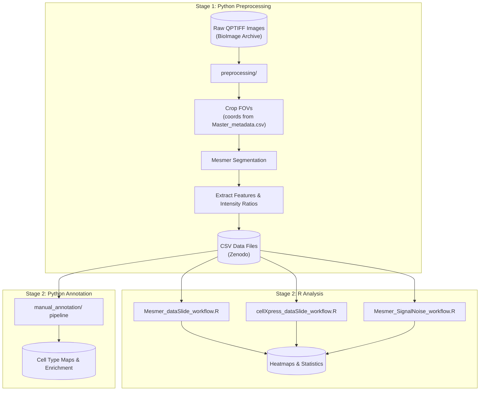

### Benchmarking Tissue Preparation

Large-scale Quantitative Assessment of Tissue Preparation and Staining Conditions for Robust Multiplexed Imaging.

#### Table of Contents

- [Project Overview](#project-overview)
- [Data & Resources](#data--resources)
- [Workflow Overview](#workflow-overview)
- [Quick Start](#quick-start)
- [Directory Structure](#directory-structure)
- [Contributors](#contributors)

## Project Overview

This repository provides analysis workflows to benchmark tissue preparation and staining conditions across multiple multiplexed imaging platforms. It generates publication-ready figures, heatmaps, and statistics comparing different antigen retrieval conditions.

**Key features:**

- Compare marker signal intensities across conditions (Mesmer/CellXpress workflows)
- Calculate signal intensity ratios inside vs outside cell masks
- Perform manual cell type annotation (Python pipeline)
- Quantify spatial heterogeneity (Balagan analysis)

## Data & Resources

### Master Metadata

**[`Master_metadata.csv`](Master_metadata.csv)** is the central reference linking all data files across repositories. Each row represents one slide with:

- **Slide_Key**: Matches naming in preprocessing scripts and CSV filenames (e.g., `slide1`, `slide2`)
- **FOV coordinates**: Used by Stage 1 preprocessing; documented here for reference
- **File paths**: Relative paths to BioImage Archive assets (masks, OME-TIFFs, GeoJSONs)

### External Data Repositories

Large data files are hosted externally due to size. Download and place in the appropriate folders before running workflows.

| Data Type                | Location                                                          | Description                                                                                   |
| ------------------------ | ----------------------------------------------------------------- | --------------------------------------------------------------------------------------------- |
| Raw Images & Annotations | [BioImage Archive](https://www.ebi.ac.uk/bioimage-archive/) (TBD) | Multiplexed images (QPTIFF), segmentation masks, cropped FOVs (OME-TIFF), cell outlines       |
| Single-cell Features     | [Zenodo](https://zenodo.org/) (TBD)                               | Per-cell marker intensities and signal ratios → place in `data_mesmer/` or `data_cellXpress/` |

### Workflow Documentation

**Stage 1: Preprocessing**

| Workflow            | Script / Folder  | Documentation                                      |
| ------------------- | ---------------- | -------------------------------------------------- |
| Image preprocessing | `preprocessing/` | [preprocessing/README.md](preprocessing/README.md) |

**Stage 2: Analysis**

_Mesmer and CellXpress are independent segmentation platforms—choose based on your data source. Signal intensity ratios use Mesmer segmentation masks only._

| Workflow                         | Script / Folder                   | Documentation                                              |
| -------------------------------- | --------------------------------- | ---------------------------------------------------------- |
| Mesmer segmentation analysis     | `Mesmer_dataSlide_workflow.R`     | [data_mesmer/README.md](data_mesmer/README.md)             |
| CellXpress segmentation analysis | `cellXpress_dataSlide_workflow.R` | [data_cellXpress/README.md](data_cellXpress/README.md)     |
| Signal intensity ratio analysis  | `Mesmer_SignalNoise_workflow.R`   | [data_mesmer/README.md](data_mesmer/README.md)             |
| Manual cell type annotation      | `manual_annotation/`              | [manual_annotation/README.md](manual_annotation/README.md) |
| Balagan spatial heterogeneity    | `balagan_analysis/`               | [balagan_analysis/README.md](balagan_analysis/README.md)   |

_Manual annotation requires Stage 1 outputs (OME-TIFFs + segmentation masks from BioImage Archive) and is used for cell phenotyping on BIDMC slides only._

## Workflow Overview



> **Note:** Most users can skip Stage 1 by downloading the pre-generated CSVs from Zenodo. Stage 1 is only needed if you want to process raw images from BioImage Archive.

**Typical entry point:** Download CSVs from Zenodo → place in `data_mesmer/` → run `Mesmer_dataSlide_workflow.R` (see [data_mesmer/README.md](data_mesmer/README.md)).

## Quick Start

```bash
# Python (for preprocessing and manual annotation)
pip install -r requirements.txt
pip install deepcell  # For Mesmer segmentation

# R packages
Rscript -e 'install.packages(c("dplyr", "tidyverse", "matrixStats", "ggcorrplot", "ggpubr", "tidyr", "rstatix", "readr", "svglite", "devtools", "qs"))'
Rscript -e 'devtools::install_github("immunogenomics/presto")'
```

Then follow the [Workflow Documentation](#workflow-documentation) for your analysis of interest.

## Directory Structure

```
.
├── preprocessing/                  # Stage 1: Image preprocessing (see README.md)
├── data_mesmer/                    # Mesmer data (see README.md)
├── data_cellXpress/                # CellXpress data (see README.md)
├── balagan_analysis/               # Spatial analysis (see README.md)
├── manual_annotation/              # Cell type annotation (see README.md)
├── Master_metadata.csv             # Central file linking all data
├── Mesmer_dataSlide_workflow.R     # Main Mesmer workflow
├── Mesmer_SignalNoise_workflow.R   # Signal intensity ratio analysis
├── cellXpress_dataSlide_workflow.R # Main CellXpress workflow
├── helper.R                        # Shared R functions
└── requirements.txt                # Python dependencies
```

## Contributors

- Johanna Schaffenrath
- Cankun Wang
- Shaohong Feng
- Lollija Gladiseva

For questions or feedback, contact Sizun Jiang: sjiang3@bidmc.harvard.edu
