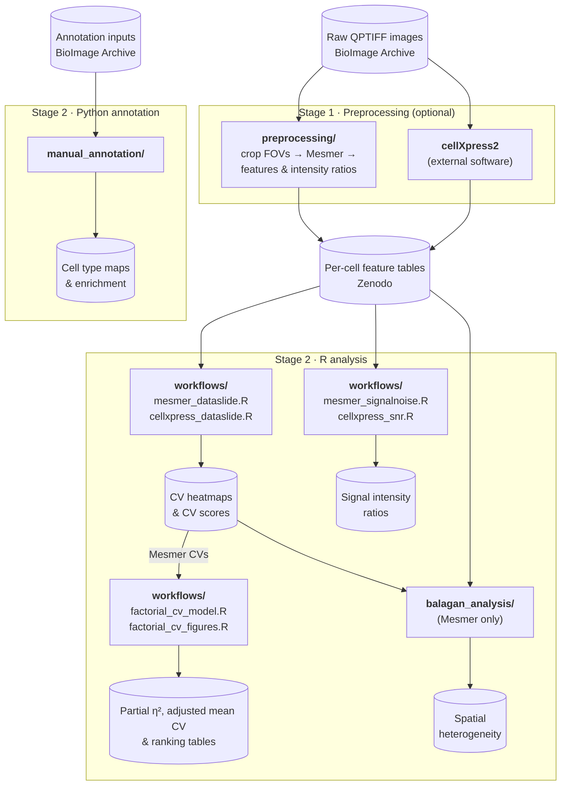

### Benchmarking Tissue Preparation

Large-scale Quantitative Assessment of Tissue Preparation and Staining Conditions for Robust Multiplexed Imaging.

#### Table of Contents

- [Project Overview](#project-overview)
- [Data & Resources](#data--resources)
- [Workflow Overview](#workflow-overview)
- [Quick Start](#quick-start)
- [Directory Structure](#directory-structure)
- [Contributors](#contributors)

## Project Overview

This repository provides analysis workflows to benchmark tissue preparation and staining conditions across multiple multiplexed imaging platforms. It generates publication-ready figures, heatmaps, and statistics comparing different antigen retrieval conditions.

**Key features:**

- Compare marker signal intensities across conditions (Mesmer/cellXpress workflows)
- Calculate signal intensity ratios inside vs outside cell masks
- Perform manual cell type annotation (Python pipeline)
- Quantify spatial heterogeneity (Balagan analysis)

## Data & Resources

### Master Metadata

**[`Master_metadata_Mesmer.csv`](Master_metadata_Mesmer.csv)** is the central reference for Mesmer workflows, linking all data files across repositories. Each row represents one slide with:

- **Slide_Key**: Matches naming in preprocessing scripts and CSV filenames (e.g., `slide1`, `slide2`)
- **FOV coordinates**: Used by Stage 1 preprocessing; documented here for reference
- **File paths**: Relative paths to BioImage Archive assets (masks, OME-TIFFs, GeoJSONs)

**[`Master_metadata_cellXpress.csv`](Master_metadata_cellXpress.csv)** contains region-level metadata for cellXpress workflows, with one row per tile/region including coordinates and dimensions.

### External Data Repositories

Large data files are hosted externally due to size. Before you run a workflow, download the files that it needs and place them as its README describes.

| Data Type                | Location                                                          | Description                                                                                             |
| ------------------------ | ----------------------------------------------------------------- | ------------------------------------------------------------------------------------------------------- |
| Raw Images & Annotations | [BioImage Archive (S-BIAD2491)](https://www.ebi.ac.uk/biostudies/bioimages/studies/S-BIAD2491) | Input for Stage 1 preprocessing: QPTIFF images, segmentation masks, cropped FOVs, cell outlines         |
| Single-cell Features     | [Zenodo (17843231)](https://zenodo.org/records/17843231)                                       | Input for Stage 2 analysis: per-cell marker intensities → place in `data_mesmer/` or `data_cellXpress/` |

### Workflow Documentation

**Stage 1: Preprocessing**

| Workflow            | Script / Folder  | Documentation                                      |
| ------------------- | ---------------- | -------------------------------------------------- |
| Image preprocessing | `preprocessing/` | [preprocessing/README.md](preprocessing/README.md) |

**Stage 2: Analysis**

_Mesmer and cellXpress are independent segmentation platforms—choose based on your data source. Signal intensity ratios use Mesmer segmentation masks only._

| Workflow                         | Script / Folder                   | Documentation                                              |
| -------------------------------- | --------------------------------- | ---------------------------------------------------------- |
| Mesmer segmentation analysis     | `workflows/mesmer_dataslide.R`    | [data_mesmer/README.md](data_mesmer/README.md)             |
| cellXpress segmentation analysis | `workflows/cellxpress_dataslide.R`| [data_cellXpress/README.md](data_cellXpress/README.md) ([cellXpress2 download](https://cellxpress.org/download)) |
| Signal intensity ratio analysis  | `workflows/mesmer_signalnoise.R`  | [data_mesmer/README.md](data_mesmer/README.md)             |
| cellXpress SNR analysis          | `workflows/cellxpress_snr.R`      | [data_cellXpress/README.md](data_cellXpress/README.md)     |
| Factorial CV reanalysis          | `workflows/factorial_cv_model.R` → `workflows/factorial_cv_figures.R` | per-site factor effects on CV (η², adjusted mean CV, ranking table) |
| Manual cell type annotation      | `manual_annotation/`              | [manual_annotation/README.md](manual_annotation/README.md) |
| Balagan spatial heterogeneity    | `balagan_analysis/`               | [balagan_analysis/README.md](balagan_analysis/README.md)   |

_Manual annotation requires Stage 1 outputs (OME-TIFFs + segmentation masks from BioImage Archive) and is used for cell phenotyping on BIDMC slides only._

## Workflow Overview


```mermaid
flowchart TD
    A[("Raw QPTIFF images<br/>BioImage Archive")]
    D[("Annotation inputs<br/>BioImage Archive")]

    subgraph S1["Stage 1 · Preprocessing (optional)"]
        B["<b>preprocessing/</b><br/>crop FOVs → Mesmer →<br/>features & intensity ratios"]
        X["<b>cellXpress2</b><br/>(external software)"]
    end

    A --> B & X
    B --> C[("Per-cell feature tables<br/>Zenodo")]
    X --> C

    subgraph S2["Stage 2 · R analysis"]
        G["<b>workflows/</b><br/>mesmer_dataslide.R<br/>cellxpress_dataslide.R"]
        I["<b>workflows/</b><br/>mesmer_signalnoise.R<br/>cellxpress_snr.R"]
        N["<b>workflows/</b><br/>factorial_cv_model.R<br/>factorial_cv_figures.R"]
        Q["<b>balagan_analysis/</b><br/>(Mesmer only)"]
        G --> J[("CV heatmaps<br/>& CV scores")]
        J -- Mesmer CVs --> N --> P[("Partial η², adjusted mean CV<br/>& ranking tables")]
        I --> K[("Signal intensity<br/>ratios")]
        J --> Q
        Q --> R[("Spatial<br/>heterogeneity")]
    end

    subgraph S3["Stage 2 · Python annotation"]
        M["<b>manual_annotation/</b>"] --> L[("Cell type maps<br/>& enrichment")]
    end

    C --> G & I & Q
    D --> M
```

> **Note:** Most users can skip Stage 1 by downloading the pre-generated CSVs from Zenodo. Stage 1 is only needed if you want to process raw images from BioImage Archive.

**Typical entry point:**

1. Download the CSVs from Zenodo.
2. Put the Mesmer CSVs in `data_mesmer/`, in the folder layout that [data_mesmer/README.md](data_mesmer/README.md) shows.
3. From the repo root, run `workflows/mesmer_dataslide.R`.

## Dependency Installation

```bash
# Python (for preprocessing and manual annotation)
pip install -r requirements.txt
pip install deepcell  # For Mesmer segmentation

# R packages
Rscript -e 'install.packages(c("dplyr", "tidyverse", "matrixStats", "ggcorrplot", "ggpubr", "tidyr", "rstatix", "readr", "svglite", "cowplot", "devtools", "qs"))'
Rscript -e 'devtools::install_github("immunogenomics/presto")'
# Additional packages for the factorial CV reanalysis (workflows/factorial_cv_*.R)
Rscript -e 'install.packages(c("car", "effectsize", "emmeans", "patchwork", "ggtext", "funkyheatmap", "ragg"))'
```

Then follow the [Workflow Documentation](#workflow-documentation) for your analysis of interest.

## Directory Structure

```
.
├── preprocessing/                  # Image preprocessing
├── data_mesmer/                    # Mesmer data
├── data_cellXpress/                # cellXpress data
├── balagan_analysis/               # Spatial analysis
├── manual_annotation/              # Cell type annotation
├── Master_metadata_Mesmer.csv      # Mesmer workflow metadata
├── Master_metadata_cellXpress.csv  # cellXpress workflow metadata
├── workflows/                      # Entry-point analyses (run from repo root)
│   ├── mesmer_dataslide.R          # Main Mesmer workflow
│   ├── mesmer_signalnoise.R        # Signal intensity ratio analysis
│   ├── cellxpress_dataslide.R      # Main cellXpress workflow
│   ├── cellxpress_snr.R            # cellXpress SNR analysis
│   ├── factorial_cv_model.R        # Factorial models of CV → effect size + adjusted mean CV tables
│   └── factorial_cv_figures.R      # Panel C (adjusted mean CV), Panel D (η² bubble), ranking table
├── scripts/                        # One-off utilities
├── R/
│   └── helper.R                    # Shared R functions
└── requirements.txt                # Python dependencies
```

## Contributors

- Johanna Schaffenrath
- Cankun Wang
- Shaohong Feng
- Lollija Gladiseva

For questions or feedback, contact Sizun Jiang: sjiang3@bidmc.harvard.edu
